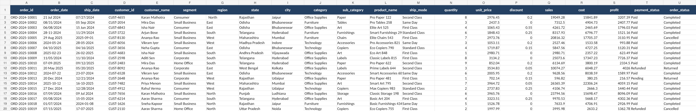
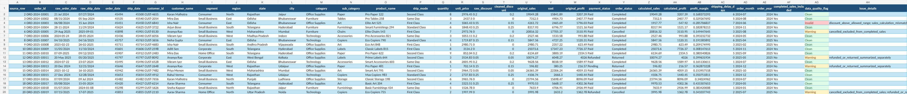
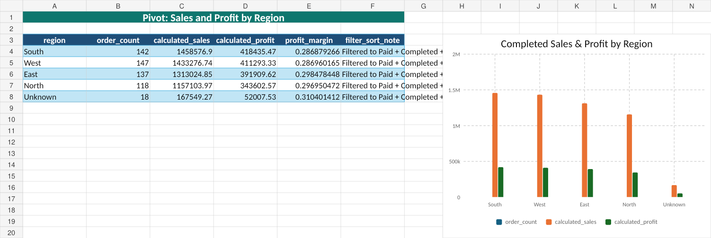
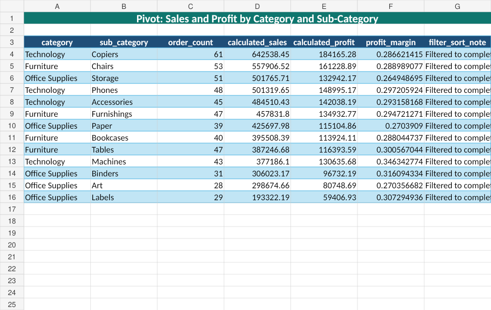

# Retail Orders Data Cleaning Project

## Problem Summary
The retail company exported order-level sales data from multiple internal systems. The raw dataset had inconsistent text formatting, date format issues, duplicate records, missing values, invalid discounts, calculation mismatches, and order/payment status inconsistencies.

This project cleans and validates the data, documents every issue found, and creates evaluator-friendly summary reports.

## Dataset Description
- Source workbook: `raw_orders.xlsx`
- Main source sheet: `raw_orders`
- Raw rows reviewed: **932**
- Source columns: order details, customer details, region/state/city, product category, shipping, quantity, unit price, discount, sales, cost, profit, payment status, and order status.

## Tools Used
- Python for controlled data validation and output generation.
- Excel workbook outputs for cleaned data, quality report, and pivot-style summaries.
- Markdown for documentation and cleaning log.

## Cleaning Steps Performed
1. Preserved the original workbook in `data/raw_orders.xlsx`.
2. Created a separate cleaned workbook in `data/cleaned_orders.xlsx`.
3. Cleaned text fields including customer, segment, region, state, city, category, sub-category, ship mode, payment status, and order status.
4. Converted date fields into a consistent Excel date format.
5. Calculated shipping delay, sales, profit, profit margin, order month, and order year.
6. Removed exact duplicate rows only.
7. Retained and flagged conflicting duplicate order IDs.
8. Validated discounts, date logic, order/payment status logic, and sales/profit calculations.
9. Created data quality and pivot summary reports.

## Business Rules Applied
- Missing `region` values were filled as `Unknown` and flagged.
- Missing `ship_mode` values were filled as `Unknown` and flagged.
- Missing `discount` values were treated as 0 only when other sales fields were valid.
- Negative discounts and discounts above 50% were flagged as invalid.
- Cancelled orders and failed payments were excluded from completed sales summaries.
- Refunded/returned orders were summarized separately.
- Ship dates earlier than order dates were flagged invalid.
- Conflicting duplicate order IDs were retained and flagged for review.

## Summary of Data Quality Issues Found
| Issue | Count |
|---|---:|
| Exact duplicate rows removed | 20 |
| Conflicting duplicate order IDs | 12 |
| Records flagged for duplicate review | 24 |
| Missing regions filled as Unknown | 25 |
| Missing ship modes filled as Unknown | 21 |
| Missing discounts treated as 0 | 18 |
| Negative discounts | 15 |
| Discounts above 50% | 15 |
| Ship date before order date | 21 |
| Sales calculation mismatches | 64 |
| Profit calculation mismatches | 64 |

## Final Clean vs Flagged Records
| Data Quality Flag | Count |
|---|---:|
| Clean | 505 |
| Warning | 356 |
| Invalid | 51 |
| Total retained cleaned records | 912 |

## Summary of Final Pivot Reports
The file `outputs/pivot_summary.xlsx` includes:
- Sales and profit by region.
- Sales and profit by category and sub-category.
- Order count by ship mode.
- Profit margin by customer segment.
- Refunded/cancelled/failed orders by region.
- Monthly sales trend.

At least two pivot outputs include sorting/filtering:
- `Sales by Region` is filtered to completed valid records and sorted by sales descending.
- `Category Subcategory` is filtered to completed valid records and sorted by sales descending.

## Key Business Insights
- Completed-sales records included in the final business summary: **562**
- Completed calculated sales: **5,529,531.73**
- Completed calculated profit: **1,617,248.52**
- Completed profit margin: **29.25%**
- Top region by completed sales: **South** with **1,458,576.90** sales.
- Top category/sub-category by completed sales: **Technology / Copiers** with **642,538.45** sales.
- Best customer segment by profit margin: **Home Office** at **30.12%**.
- Highest completed-sales month: **2025-02** with **394,995.69** sales.

## Assumptions and Limitations
- Slash dates were interpreted as `mm/dd/yyyy`; hyphen dates were interpreted as `dd-mm-yyyy`.
- Discount maximum was assumed to be 50% because the prompt did not provide the allowed range.
- Calculation mismatch tolerance was 0.05 to handle rounding differences.
- Conflicting duplicate order IDs were not deleted; they were flagged for business review.
- Completed sales summaries exclude invalid and duplicate-conflict records.

## Screenshots Included
- `screenshots/raw_data_preview.png` — raw dataset before cleaning.
- `screenshots/cleaned_data_preview.png` — cleaned dataset with calculated columns.
- `screenshots/pivot_summary_1.png` — major pivot summary.
- `screenshots/pivot_summary_2.png` — another major pivot summary.

